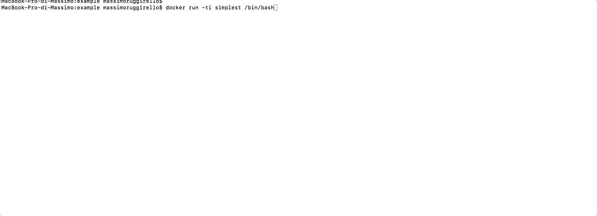

# simplest

The best way to undestand something is start from scratch.


From google I found [scratch image](https://hub.docker.com/_/scratch/). I think is better with something more structure but simple like [ubuntu image](https://hub.docker.com/_/ubuntu/).

## 1. Create an empty file called Dockerfile
 
 > A Dockerfile is a text document that contains all the commands a user could call on the command line to assemble an image.
 [referece](https://docs.docker.com/engine/reference/builder/)

```
$ mkdir example && \
cd example && \
touch Dockerfile
```

## 2. Put inside

```text
FROM ubuntu
```

## 3. Building the image
```bash
$ docker build -t simplest .
```

## 4. Launching a container

```bash
$ docker run -ti simplest /bin/bash
```

### run some commands insde like



```bash
$ ps aux
```
[ps referece](http://www.linfo.org/ps.html)
